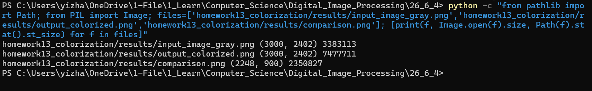
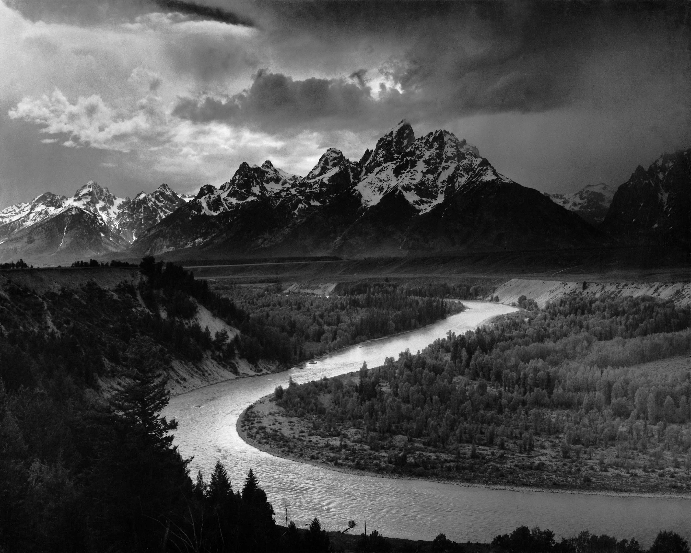
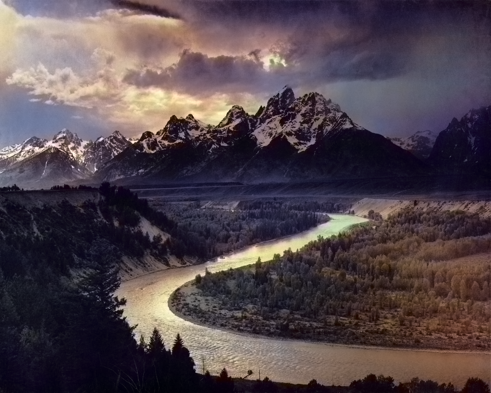
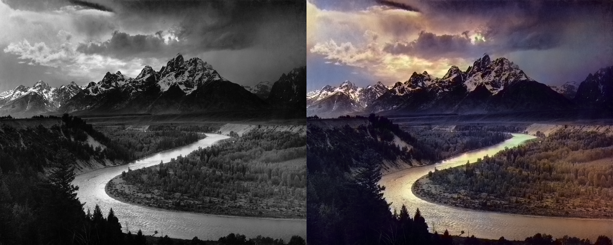

# 《Colorful Image Colorization》阅读报告

## 一、论文基本信息

- 论文题目：Colorful Image Colorization
- 作者：Richard Zhang, Phillip Isola, Alexei A. Efros
- 会议：European Conference on Computer Vision (ECCV)
- 发表年份：2016
- 论文主题：基于深度学习的自动图像彩色化

Zhang 等人在 ECCV 2016 发表的这篇论文研究的是自动图像彩色化问题，也就是给定一张灰度图像，自动生成一张合理的彩色图像。第十四章课件中把图像彩色化定义为“将灰度图像转换为彩色图像”，这篇论文正好对应这一任务。

这篇论文的特点是没有把彩色化简单看作回归问题，而是把颜色预测建模为分类问题。模型输入灰度图像的亮度信息，输出每个像素可能的颜色分布，再根据颜色分布生成最终彩色结果。论文题目中的 “Colorful” 也说明了作者的一个重要目标：不仅要得到看起来合理的颜色，还希望结果不要过于灰暗。

## 二、阅读背景与问题引入

图像彩色化看起来像是“给黑白照片上色”，但实际问题比普通滤镜复杂得多。灰度图像只保留了亮度信息，丢失了颜色信息。同一块灰度区域可能对应很多真实颜色，例如一片中等亮度区域可能是绿色树林、黄色草地，也可能是棕色岩石。也就是说，从灰度图恢复彩色图并不是一个有唯一答案的问题。

第十四章课件中介绍了多种图像彩色化方法，包括用户交互图像上色、基于彩色参考图的上色、基于语言或文字的上色，以及基于多模态的自动图像上色。交互式方法通常需要用户给出颜色点、线条、涂鸦或参考图像，这样结果更容易符合用户意图，但人工参与较多。参考图方法需要找到合适的彩色参考图，如果参考图和目标灰度图差异较大，颜色迁移效果也会受到影响。

自动图像上色的目标是尽量减少人工输入，让模型自己从大量彩色图像中学习物体和颜色之间的关系。课件中提到，全自动图像上色可以理解为把大量彩色图像数据集提供给模型，让模型学习图像中每个对象可能的颜色。Zhang 等人的方法就是这一思路的代表工作之一。

这篇论文要解决的问题可以概括为：如何让神经网络根据灰度图像中的结构和语义信息，预测出较合理、较有颜色变化的彩色结果？它的难点不只是让颜色“对”，还包括避免输出结果过灰、过保守。

## 三、论文核心思想

论文的核心思想是把图像彩色化从直接预测连续颜色值，改成预测离散颜色类别。具体来说，作者使用 Lab 色彩空间，把图像分成 L 通道和 ab 通道。L 通道表示亮度，对应灰度图中的结构和明暗信息；ab 通道表示颜色，是模型需要预测的部分。

对于一张彩色图像，训练时可以把它转换到 Lab 空间，取出 L 通道作为输入，把 ab 通道作为监督信号。模型学习的目标就是：给定 L 通道，预测每个像素位置的 ab 颜色。论文没有直接用均方误差回归 ab 值，而是把 ab 颜色空间量化成 313 个有效颜色类别，让模型预测每个像素属于这些颜色类别的概率。

我阅读这篇论文时，个人理解是是：彩色化本身有多种答案，因此不适合简单要求模型输出一个平均颜色。如果使用回归损失，模型为了降低平均误差，容易把多种可能颜色折中成灰暗颜色。把颜色预测改成分类后，模型可以保留颜色分布中的多种可能性，再通过后处理选择更鲜明的颜色结果。

## 四、方法原理分析

### 4.1 图像彩色化任务与 Lab 色彩空间

图像彩色化任务的输入是一张灰度图像，输出是一张彩色图像。如果直接在 RGB 空间中处理，红、绿、蓝三个通道同时包含亮度和颜色信息，不容易把“图像结构”和“颜色预测”分开。Lab 色彩空间更适合这个任务，因为它把亮度和颜色分离开来。

Lab 图像可以表示为：

$$
\mathbf{X}_{Lab} = (L, a, b)
$$

其中，$L$ 表示亮度通道，主要包含图像的明暗、边缘和结构信息；$a$ 和 $b$ 表示色度通道，主要描述颜色方向和颜色强度。按照课件中的说明，Lab 模式包含三个通道，第一个通道是明度 L，a 通道大致表示从绿色到红色的变化，b 通道大致表示从蓝色到黄色的变化。

在彩色化任务中，可以把问题写成：

$$
\hat{a}, \hat{b} = F(L)
$$

其中，$F$ 表示神经网络模型；$L$ 是输入灰度图像对应的亮度通道；$\hat{a}$ 和 $\hat{b}$ 是模型预测出的两个颜色通道。

这个表示的意义在于，模型不需要重新生成图像的亮度结构，而是专注于根据亮度图中的形状、纹理和语义信息补充颜色。这样既符合灰度图像本身的信息特点，也方便后续把预测颜色和原始亮度重新组合成彩色图。

### 4.2 L 通道与 ab 通道的关系

L 通道可以理解为一张图像的“黑白版本”，它保存了图像中哪里亮、哪里暗、边缘在哪里、物体大致是什么形状。ab 通道则保存颜色信息。如果 L 通道固定，只改变 ab 通道，图像结构基本不变，但颜色会发生变化。

在代码中，预处理函数 `preprocess_img()` 正是利用了这种关系：

```python
img_lab_orig = color.rgb2lab(img_rgb_orig)
img_lab_rs = color.rgb2lab(img_rgb_rs)

img_l_orig = img_lab_orig[:, :, 0]
img_l_rs = img_lab_rs[:, :, 0]
```

这里先把 RGB 图像转换到 Lab 空间，再取第 0 个通道作为 L 通道。`img_l_orig` 来自原始尺寸图像，用于最后重建时保留原图的亮度细节；`img_l_rs` 来自缩放到 `256 x 256` 的图像，用于输入模型。

如果用符号表示，预处理过程可以写成：

$$
(L, a, b) = \operatorname{RGB2Lab}(I)
$$

其中，$I$ 表示输入图像；$\operatorname{RGB2Lab}$ 表示从 RGB 空间到 Lab 空间的转换；$L$ 是后续输入模型的亮度信息；$a,b$ 在训练阶段作为颜色监督，在测试阶段则由模型预测。

这一步解决的问题是把彩色化任务拆开：灰度图已经提供 L 通道，模型只需要预测缺失的 ab 通道。这样任务更清晰，也更符合图像彩色化的本质。

### 4.3 颜色预测的分类建模

传统思路可能会让模型直接回归每个像素的 a、b 数值，也就是直接预测两个连续值。但论文指出，这样容易得到偏灰的结果。原因是同一个灰度输入可能对应多种合理颜色，回归模型在多种颜色之间取平均时，可能产生不鲜明的中间颜色。

为了解决这个问题，论文把 ab 颜色空间量化为 313 个有效颜色类别。对每个像素，模型不再直接输出一个颜色点，而是输出它属于每个颜色类别的概率。设颜色类别数为 $Q$，论文中 $Q=313$。对某个像素位置 $(h,w)$，模型输出为：

$$
\hat{\mathbf{Z}}_{h,w} = \{\hat{Z}_{h,w,1}, \hat{Z}_{h,w,2}, \ldots, \hat{Z}_{h,w,Q}\}
$$

其中，$\hat{\mathbf{Z}}_{h,w}$ 表示像素 $(h,w)$ 的颜色类别预测分布；$\hat{Z}_{h,w,q}$ 表示该像素属于第 $q$ 个颜色类别的概率；$Q$ 表示颜色类别总数。

训练时可以使用交叉熵损失来衡量预测分布和真实颜色类别之间的差异：

$$
\mathcal{L} = - \sum_{h,w} \sum_{q=1}^{Q} Z_{h,w,q} \log \hat{Z}_{h,w,q}
$$

其中，$\mathcal{L}$ 表示分类损失；$Z_{h,w,q}$ 是真实颜色在第 $q$ 个类别上的标记；$\hat{Z}_{h,w,q}$ 是模型预测概率；$\sum_{h,w}$ 表示对所有像素位置求和；$\sum_{q=1}^{Q}$ 表示对所有颜色类别求和。

这个公式的直观含义是，如果真实颜色对应的类别概率被模型预测得越高，损失就越小；如果模型把概率分给了错误颜色类别，损失就会变大。这样模型学习的是颜色分布，而不是简单平均颜色。

在代码中，ECCV16 模型最后阶段也体现了这一思想：

```python
self.softmax = nn.Softmax(dim=1)
self.model_out = nn.Conv2d(313, 2, kernel_size=1, padding=0, dilation=1, stride=1, bias=False)
```

其中，`313` 对应量化后的颜色类别数。`softmax` 将网络输出转换为颜色类别概率，`model_out` 再把颜色类别分布转换为最终的 2 个 ab 通道。

### 4.4 类别重加权与颜色多样性

自然图像中的颜色分布是不均衡的。很多区域的颜色接近灰色、白色、黑色或低饱和颜色，而鲜艳颜色出现频率较低。如果直接训练模型，模型会更偏向预测常见颜色，因为这样更容易降低平均损失。结果就是图像看起来安全但不够鲜明。

论文使用类别重加权来缓解这个问题。可以把加入权重后的损失写成：

$$
\mathcal{L}_{weighted} = - \sum_{h,w} v(Z_{h,w}) \sum_{q=1}^{Q} Z_{h,w,q} \log \hat{Z}_{h,w,q}
$$

其中，$\mathcal{L}_{weighted}$ 表示带类别权重的分类损失；$v(Z_{h,w})$ 表示像素 $(h,w)$ 对应真实颜色类别的权重；其他符号与前面的交叉熵公式相同。

这个权重的作用是让稀有颜色在训练中得到更高关注，让常见颜色的影响不要过强。直观地说，如果训练集中大量像素都是灰色或低饱和颜色，模型很容易学成“尽量输出灰色”。重加权后，红色、蓝色、绿色等相对少见的颜色也能对训练产生更明显的影响。

这个方法解决的是颜色多样性问题。它并不是让模型随意上色，而是减少训练数据中常见颜色对模型的支配，使模型在合适区域更敢于预测有色彩的结果。这也是论文题目中 “Colorful” 的重要含义。

### 4.5 彩色图像重建过程

模型输出 ab 通道后，还需要把它和原始亮度信息重新组合，才能得到最终 RGB 图像。代码中的 `postprocess_tens()` 完成了这个过程：

```python
out_ab_orig = F.interpolate(out_ab, size=HW_orig, mode='bilinear')
out_lab_orig = torch.cat((tens_orig_l, out_ab_orig), dim=1)
return color.lab2rgb(out_lab_orig.data.cpu().numpy()[0, ...].transpose((1,2,0)))
```

由于模型通常在 `256 x 256` 尺寸上预测颜色，而原始图像可能更大，所以代码先用双线性插值把预测的 ab 通道放大到原图尺寸。然后把原图尺寸的 L 通道和预测的 ab 通道拼接起来：

$$
\hat{I}_{Lab} = (L_{orig}, \hat{a}, \hat{b})
$$

其中，$\hat{I}_{Lab}$ 表示重建得到的 Lab 图像；$L_{orig}$ 表示原始尺寸的亮度通道；$\hat{a}, \hat{b}$ 表示模型预测并放大后的颜色通道。

最后再进行颜色空间转换：

$$
\hat{I}_{RGB} = \operatorname{Lab2RGB}(\hat{I}_{Lab})
$$

其中，$\hat{I}_{RGB}$ 就是最终可显示和保存的彩色图像。

这个重建过程的作用是保留原图的亮度和结构细节，只把模型预测出的颜色补充进去。因此，彩色化结果一般不会改变图像中山体、河流、云层等结构位置，而主要改变颜色外观。

## 五、与课上内容的联系

彩色化方法可以分为用户交互图像上色和自动图像上色等方向。Zhang 等人的方法属于自动图像上色，输入端不需要用户涂鸦、颜色点或参考图，而是依靠训练好的神经网络自动预测颜色。

课上在介绍参考图上色时提到使用 CIELab 色彩空间进行颜色量化，并说明 L、a、b 三个通道的含义。论文中的方法也使用 Lab 空间，而且进一步把 ab 颜色空间量化为 313 个颜色类别。这说明 Lab 空间不仅适合传统或参考图方法，也适合深度学习彩色化方法。

课件后半部分提到自动图像上色的思路：使用较大的数据集训练神经网络，再把黑白图像输入训练好的模型进行预测。论文正是这一思路的具体实现。它使用大量彩色图像训练模型，让模型从图像内容和颜色之间的关系中学习规律。测试时，只输入灰度图像的 L 通道，模型就能预测对应的 ab 通道。

课件也提醒了自动图像上色的局限，例如模型通常只能较好预测训练集中出现过的对象，对一些特殊或合成图像可能效果不好。这一点和论文方法的局限是一致的。模型不是理解了所有真实世界颜色，而是从训练数据中学习统计规律，因此遇到少见场景时可能会预测不准确。

## 六、论文创新点

首先，论文把彩色化任务从回归问题转化为分类问题。与直接预测连续 ab 值相比，分类建模更适合处理“一张灰度图可能对应多种合理颜色”的情况。它能表达颜色的多种可能性，减少简单平均带来的灰暗结果。

第二，论文使用了颜色类别重加权。自然图像中低饱和颜色较多，如果不处理类别不均衡，模型容易倾向于输出保守颜色。重加权机制提高了稀有颜色的重要性，使模型更有可能生成较鲜明的颜色。

第三，论文在 Lab 空间中完成任务设计，把亮度和颜色分离。这样输入、预测目标和最终重建过程都比较清晰。模型输入 L 通道，预测 ab 通道，再与原始 L 通道合成彩色图像，整个流程符合图像彩色化的直观理解。

## 七、方法局限性

首先，彩色化本身具有不确定性。灰度图像中没有颜色信息，因此模型无法保证恢复真实颜色。它只能根据训练数据和图像内容预测一种可能合理的颜色。对于历史照片或特殊场景，如果需要真实颜色，自动彩色化结果只能作为参考。

其次，模型容易受到训练数据分布影响。如果某些物体在训练集中颜色比较固定，模型会倾向于输出常见颜色；如果遇到训练集中较少出现的物体或非典型颜色，结果可能不准确。例如一辆车可能是红色、蓝色或黑色，但灰度图中不一定能判断。

再次，分类建模虽然提高了颜色多样性，但也可能带来局部颜色不稳定。某些区域可能出现轻微偏色，或者不同物体之间颜色边界不够准确。对于细小结构和复杂纹理区域，颜色预测也可能出现扩散或不一致。

最后，论文方法主要依赖输入图像本身和训练数据，没有用户控制机制。如果用户希望某个区域使用指定颜色，例如让衣服变成红色或让天空保持灰色，单纯自动模型不容易满足这种需求。这也是后来一些可控彩色化方法继续研究的方向。

## 八、个人理解与启发

我对图像彩色化的理解是：图像彩色化不仅是"补上缺失的 RGB 通道"，而是一个带有推测性质的视觉生成问题。灰度图只告诉模型哪里亮、哪里暗、哪里有边缘，但没有告诉模型这个物体真实是什么颜色。因此，模型输出的颜色更像是基于经验的合理猜测。

这篇论文让我印象比较深的是它没有直接使用均方误差去回归颜色。刚开始看彩色化任务时，我会自然地想到让模型预测 a、b 两个连续数值，然后和真实颜色做差。但论文指出，这样容易把多种可能颜色平均成不鲜明的颜色。比如一片区域可能是绿色或棕色，直接平均可能得到一种灰暗的中间色。分类建模能更好地保留颜色的不确定性，这是我觉得比较巧妙的地方。

我还注意到，Lab 空间在这个任务中不只是一个颜色格式转换工具，而是影响了整个问题的建模方式。因为 L 和 ab 可以分开，模型才可以明确地以 L 为输入、以 ab 为目标。这个思路也让我理解到，图像处理中的颜色空间选择并不是形式问题，它会影响算法如何描述问题。

从实验结果看，模型确实能根据山、云、树林和河流等结构生成一定颜色。但这些颜色并不一定等于真实拍摄时的颜色。比如天空和云层中出现的紫灰色、暖色变化可能是模型根据训练数据推测出来的；河流和树林的颜色也有一定主观性。因此，我更倾向于这是“视觉上合理的彩色化结果”，而不是“真实颜色恢复”。

这篇论文对我的启发是，深度学习方法并不只是把网络加深，还需要根据任务特点重新设计输出形式和损失函数。对于彩色化这种多解问题，把输出设计成概率分布，比直接输出单一数值更合理。这一点也可以迁移到其他图像生成任务中，例如图像修复、超分辨率和风格迁移等问题。

## 九、代码运行与实验结果分析

本次实验使用 `richzhang/colorization` 官方 PyTorch demo，对自选灰度图像 `input_image.jpg` 进行彩色化处理。主结果采用 ECCV16 模型输出，因为它对应本文阅读的 ECCV 2016 论文。代码运行流程主要包括读取输入图像、转换到 Lab 空间、提取 L 通道、加载预训练模型、预测 ab 通道、合成 Lab 图像并转换回 RGB 图像。

终端检查结果如下图所示。截图中可以看到输入灰度图、输出彩色图和对比图已经生成，并且能够读取到图像尺寸。



实验输入灰度图如下。该图是一张山景灰度图，包含天空、云层、雪山、树林和河流等区域。由于输入图像本身没有颜色信息，模型需要根据图像结构推测这些区域可能的颜色。



ECCV16 模型输出的彩色化结果如下。



从视觉效果看，模型能够为图像补充一定颜色信息。天空和云层区域出现了蓝灰、紫灰以及偏暖的颜色变化；山体暗部整体仍保持较低饱和度，没有出现大面积突兀的高饱和颜色；河流和树林区域带有浅绿色、黄色或暖色倾向。整体上，图像从灰度输入变成了具有颜色层次的彩色图。

不过，这个结果也存在不确定性。云层和天空中的紫色、暖色变化可能带有一定主观推测成分；河流区域的浅绿色或偏黄色不一定符合真实场景；树林部分虽然有绿色倾向，但局部颜色仍较暗。由此可以看出，模型生成的是一种视觉上较合理的颜色结果，而不是对真实颜色的准确恢复。

输入输出对比图如下。左侧为输入灰度图，右侧为 ECCV16 彩色化输出。



从对比图可以看出，模型主要在天空、云层、树林和河流区域增加颜色。雪山和山体暗部由于本身亮度对比较强，彩色化前后的结构变化较小，颜色变化也比较保守。树林区域获得了一定绿色和暖色倾向，有助于和山体、河流区分开。天空和云层区域的颜色更丰富，但局部偏紫或偏暖，说明模型对自然场景颜色有一定推测性。

官方 demo 同时生成了 SIGGRAPH17 模型结果 `results/input_image_colorized_siggraph17.png`。从本图像的视觉效果看，SIGGRAPH17 输出的色彩更保守，森林和天空区域反而看起来更自然一些。但由于本次阅读论文还是 *Colorful Image Colorization*，报告主结果仍采用 ECCV16 输出。

结合代码阅读可以看出，实验结果的生成过程与论文方法是一致的。`demo_release.py` 中先调用 `preprocess_img()` 得到 L 通道，再通过 `eccv16(pretrained=True)` 加载预训练模型，最后用 `postprocess_tens()` 把原始 L 通道和预测 ab 通道合成为 RGB 图像。也就是说，模型并没有改变原图的主体结构，而是在原有亮度基础上补充颜色。

## 十、总结

从数字图像处理课程角度看，这篇论文很好地连接了传统颜色空间知识和深度学习方法。Lab 色彩空间、颜色量化、分类损失、神经网络预测和 RGB 重建共同组成了完整的彩色化流程。它也说明，在解决图像处理问题时，合理的问题建模往往和网络结构同样重要。

## 参考文献

[1] Richard Zhang, Phillip Isola, Alexei A. Efros. Colorful Image Colorization. ECCV, 2016.

[2] Richard Zhang, Phillip Isola, Alexei A. Efros. Colorful Image Colorization. arXiv:1603.08511. https://arxiv.org/abs/1603.08511

[3] richzhang/colorization 官方代码仓库. https://github.com/richzhang/colorization

[4] Colorful Image Colorization 项目主页. https://richzhang.github.io/colorization/